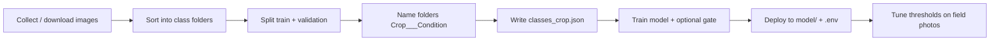

# AGRIC AI — Crop disease dataset structure guide

This document explains **how to organize image datasets** so they work with AGRIC AI training scripts (`training/train_tomato.py`, `training/kaggle_train_full.py`) and the production API.

Use it when you collect or download datasets for **new crops** (maize, beans, avocado, etc.) or when you expand the existing **tomato** dataset.

---

## 1. Top-level layout (required)

Every dataset must split images into **training** and **validation** folders. This matches the standard layout used on Kaggle and in our tomato pipeline.

```
your-crop-dataset/
├── train/          ← model learns from these images
└── validation/     ← model is evaluated during training (also named val/ or valid/)
```

| Folder | Purpose | Typical share |
|--------|---------|----------------|
| `train/` | Used to update model weights | ~80% of all images |
| `validation/` | Held out during training to measure accuracy and stop overfitting | ~20% |

**Rules**

- `train/` and `validation/` must contain **the same class folder names** (see §2).
- Each class folder holds **only image files** (`.jpg`, `.jpeg`, `.png`, `.webp`, `.bmp`).
- Do **not** put an `unknown` folder in the dataset — the API uses `unknown` at runtime when confidence is low.
- Scripts also accept `val/` or `valid/` instead of `validation/`.

If you only have one big folder tree (no split yet), `train_tomato.py` can auto-split ~80/20 — but **pre-split `train` + `validation` is preferred** for reproducibility.

---

## 2. Class folders (one folder = one label)

Inside `train/` and `validation/`, **each immediate subfolder is one disease or healthy class**.

```
your-crop-dataset/
├── train/
│   ├── Crop___Disease_A/
│   │   ├── img_001.jpg
│   │   ├── img_002.jpg
│   │   └── ...
│   ├── Crop___Disease_B/
│   └── Crop___healthy/
└── validation/
    ├── Crop___Disease_A/
    ├── Crop___Disease_B/
    └── Crop___healthy/
```

### Naming convention (recommended)

Follow the **PlantVillage** style already used for tomato:

```
{CROP}___{CONDITION}
```

| Part | Meaning | Examples |
|------|---------|----------|
| `CROP` | Crop name, PascalCase | `Tomato`, `Maize`, `Bean`, `Avocado` |
| `___` | Three underscores (separator) | `Tomato___` |
| `CONDITION` | Disease or `healthy` | `Early_blight`, `healthy`, `Common_rust` |

**Examples**

- `Tomato___Early_blight`
- `Maize___Common_rust`
- `Bean___Angular_leaf_spot`
- `Tomato___healthy`

Folder names become **`class_id`** values in `data/classes_<crop>.json` and in the trained model. Keep names **stable** — renaming after training breaks deployed models.

---

## 3. Reference: tomato dataset (current production crop)

Our tomato model is trained on the Kaggle-style **tomatoes-leaf-disease-detection** layout. Use this as the template for other crops.

### 3.1 Folder tree (minimum — 10 classes)

```
tomatoes-leaf-disease-detection/
├── train/
│   ├── Tomato___Bacterial_spot/
│   ├── Tomato___Early_blight/
│   ├── Tomato___Late_blight/
│   ├── Tomato___Leaf_Mold/
│   ├── Tomato___Septoria_leaf_spot/
│   ├── Tomato___Spider_mites Two-spotted_spider_mite/
│   ├── Tomato___Target_Spot/
│   ├── Tomato___Tomato_Yellow_Leaf_Curl_Virus/
│   ├── Tomato___Tomato_mosaic_virus/
│   └── Tomato___healthy/
└── validation/
    └── (same 10 folder names as train/)
```

### 3.2 Recommended extension — reject class + gate

For field use (farmers upload wrong photos), add a **non-crop reject** folder and train the **tomato leaf gate**:

```
tomatoes-leaf-disease-detection/
├── train/
│   ├── Tomato___Early_blight/
│   ├── ... (all tomato classes)
│   ├── Tomato___healthy/
│   └── Not_Tomato/              ← 500+ images, see §5
│       ├── maize_leaves/
│       ├── bean_leaves/
│       ├── faces/
│       └── random_photos/
└── validation/
    ├── Not_Tomato/
    └── (all tomato class folders)
```
---

## 4. Adding a new crop (e.g. maize, beans, avocado)

You can use either strategy below. For Rwanda field deployment, **Strategy A (one model per crop)** is what we use for tomato today.

### Strategy A — One model per crop (recommended)

Train a **dedicated classifier** per crop, plus an optional **crop gate** (tomato gate pattern).

```
maize-leaf-disease/
├── train/
│   ├── Maize___Common_rust/
│   ├── Maize___Gray_leaf_spot/
│   ├── Maize___Northern_Leaf_Blight/
│   ├── Maize___healthy/
│   └── Not_Maize/                 ← optional: other crops, soil, faces
└── validation/
    └── (mirror train class names)
```

```
beans-leaf-disease/
├── train/
│   ├── Bean___Angular_leaf_spot/
│   ├── Bean___Bean_rust/
│   ├── Bean___healthy/
│   └── Not_Bean/
└── validation/
    └── ...
```

**Also create**

- `data/classes_maize.json` — same `class_id` list as folders + farmer text (EN/RW)
- Crop-specific training script or adapt `train_tomato.py` with `MAIZE_DATASET_PATH`
- App config: `CLASSES_PATH`, `MODEL_PATH`, gate paths

### Strategy B — Single multi-crop model

All crops share **one** `train/` tree; every class folder is globally unique.

```
agricai-dataset/
├── train/
│   ├── Tomato___Late_blight/
│   ├── Maize___Common_rust/
│   ├── Bean___Angular_leaf_spot/
│   └── ...
└── validation/
    └── (same folder names)
```

Use `training/kaggle_train_full.py` — classes are discovered automatically from folder names.

**Pros:** one model file  
**Cons:** more confusion between similar-looking leaves; needs more data per class; harder to enable crop-specific gates and reports

---

## 5. Reject folders (`Not_<Crop>`)

When farmers scan the wrong subject, the model should **refuse** instead of guessing a disease.

| Folder | When to use |
|--------|-------------|
| `Not_Tomato/` | Maize/bean leaves, fruit, faces, documents, indoor scenes |
| `Not_Maize/` | Tomato/bean leaves, non-leaf photos |
| `Not_Bean/` | Other crops, irrelevant images |

**Content guidelines for `Not_*`**

- Other crop leaves (at least 3–4 common local crops)
- Tomato/maize **fruit** (not leaves)
- Soil-only, tools, hands, faces
- Screenshots, posters, blurry indoor photos
- **Minimum:** 500 images in `train/Not_<Crop>/`, ~100 in `validation/Not_<Crop>/`

Subfolders inside `Not_Tomato/` (e.g. `maize_leaves/`) are optional — the trainer treats all images under `Not_Tomato/` as one class.

---

## 6. Image content rules (all crops)

Images should match what farmers will **photograph in the app**.

| Do | Don't |
|----|--------|
| One **leaf** (or crop-appropriate organ) fills most of the frame | Whole field panoramas |
| Even daylight, in-focus | Heavy blur, flash blow-out |
| Show disease spots / discoloration clearly | Only distant plant shots |
| Include **real phone photos** from local fields | Only clean lab backgrounds |
| Same crop part per class (leaves for leaf diseases) | Mix fruit and leaf in one class |

**Target counts (minimum)**

| Class type | Train images | Validation images |
|------------|--------------|-------------------|
| Each disease / healthy | **100+** | **20+** |
| `Not_<Crop>` reject | **500+** | **100+** |
| Ideal per disease | **300–500+** | **50–100+** |

More field diversity (shade, rain, multiple leaves in background) improves real-world accuracy when combined with app-side leaf cropping.

---

## 7. Pairing dataset folders with `classes.json`

Every folder under `train/` (except optional nested folders inside `Not_*`) needs a matching entry in a JSON knowledge file.

**Example** (`data/classes_tomato.json`):

```json
{
  "classes": [
    {
      "class_id": "Tomato___Early_blight",
      "type": "disease",
      "diseaseName": "Tomato Early Blight",
      "diseaseNameRw": "Indwara ya Early blight y'inyanya",
      "explanation": "...",
      "explanationRw": "...",
      "treatment": "...",
      "treatmentRw": "...",
      "prevention": "...",
      "preventionRw": "...",
      "care": "...",
      "careRw": "..."
    }
  ]
}
```

| Field | Rule |
|-------|------|
| `class_id` | **Must exactly match** the dataset folder name |
| `type` | `healthy`, `disease`, `pest`, or `unknown` |
| `diseaseName` / `diseaseNameRw` | Shown in app and PDF report |
| Other text fields | Farmer guidance after detection |

**Order matters:** `class_id` order in JSON should match the order the training script writes to `class_names.json` / model output indices.

Reserved IDs (do not use as train folders):

- `unknown` — API-only, low-confidence reject
- Optionally `Not_<Crop>` — train folder **and** JSON entry if using 11th-class reject

---

## 8. End-to-end workflow for a new crop



**Checklist**

- [ ] `train/` and `validation/` exist with **identical** class folder names  
- [ ] Each class has enough images (§6)  
- [ ] Folder names follow `{Crop}___{Condition}`  
- [ ] `Not_<Crop>/` added if deploying crop-specific gate  
- [ ] `data/classes_<crop>.json` created with matching `class_id` values  
- [ ] Field test photos collected for `scripts/tune_thresholds.py`  
- [ ] Report enrichment / translations added in the frontend (if using enhanced reports)

---

## 9. Acceptable layout variants

Training scripts resolve these automatically:

| Layout | Supported | Notes |
|--------|-----------|--------|
| `root/train/` + `root/validation/` | Yes | **Preferred** |
| `root/train/` + `root/val/` | Yes | `val` alias |
| `root/CropName/train/` (nested) | Yes | Auto-discovered on Kaggle |
| `root/ClassA/`, `root/ClassB/` only | Yes | Auto 80/20 split into `split_data/` |
| Flat mix of crops without `Crop___` prefix | Discouraged | Risk of name collisions |

**Ignored folder names** (never treated as classes):  
`train`, `val`, `validation`, `test`, `unknown`, `other`, `misc`, `background`, `__MACOSX`, `.ipynb_checkpoints`

---

## 10. Example: beans dataset skeleton

```
beans-leaf-disease/
├── README.md                    ← source, license, date collected
├── train/
│   ├── Bean___Angular_leaf_spot/    (150 images)
│   ├── Bean___Bean_rust/            (150 images)
│   ├── Bean___Common_bacterial_blight/
│   ├── Bean___healthy/              (200 images)
│   └── Not_Bean/                    (500 images)
└── validation/
    ├── Bean___Angular_leaf_spot/    (30 images)
    ├── Bean___Bean_rust/            (30 images)
    ├── Bean___Common_bacterial_blight/
    ├── Bean___healthy/              (40 images)
    └── Not_Bean/                    (100 images)
```

---

## 11. Where this fits in the repo

| Item | Location |
|------|----------|
| Tomato training | `training/train_tomato.py`, [TRAIN_TOMATO.md](./TRAIN_TOMATO.md) |
| Multi-crop training | `training/kaggle_train_full.py` |
| Tomato class metadata | `data/classes_tomato.json` |
| Model outputs | `model/` (`.keras`, `.onnx`, `class_names.json`) |
| Threshold tuning | `scripts/tune_thresholds.py` |
| Inference & gates | `app/inference/engine.py`, `app/inference/tomato_gate.py` |

---

## 12. Quick comparison: tomato vs new crop

| Aspect | Tomato (reference) | New crop |
|--------|-------------------|----------|
| Split | `train/` + `validation/` | Same |
| Class folders | `Tomato___*` | `Maize___*`, `Bean___*`, etc. |
| Healthy class | `Tomato___healthy` | `Maize___healthy`, etc. |
| Reject class | `Not_Tomato/` | `Not_Maize/`, `Not_Bean/`, … |
| Knowledge file | `classes_tomato.json` | `classes_<crop>.json` |
| Gate model | `tomato_leaf_gate.keras` | `<crop>_leaf_gate.keras` (optional) |

---

## 13. Licensing and documentation

For each dataset you add, keep a small `README.md` next to the folders with:

- Crop and disease list  
- Source (PlantVillage, field collection, partner NGO, etc.)  
- License (CC BY, research-only, etc.)  
- Date and region (e.g. Rwanda, East Africa)  
- Known gaps (e.g. “only 50 images for Late blight — need more”)

This helps the team track which crops are ready for training and which need more field collection.

---

**Summary:** Organize every crop dataset as **`train/` + `validation/`**, with **one folder per class** named `{Crop}___{Condition}`, mirror the **tomato** layout, add **`Not_<Crop>`** for wrong uploads, and wire folders to **`classes_<crop>.json`** before training.

For tomato-specific commands, continue with [TRAIN_TOMATO.md](./TRAIN_TOMATO.md).
